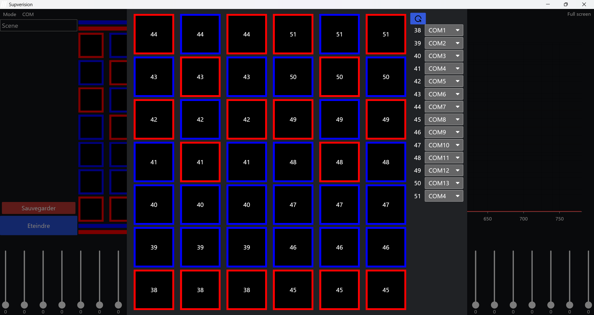
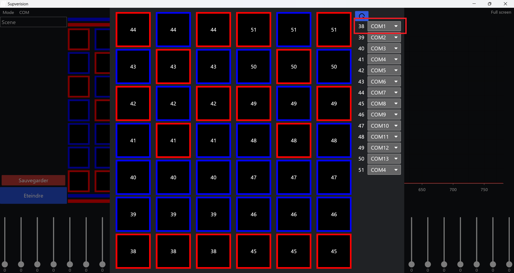

# Supervision

## Sommaire
1. [Introduction](#introduction)
2. [Logiciel](#logiciel)  
    a. [Avant de lancer le logiciel](#avant-de-lancer-le-logiciel)  
    b. [Premier lancement](#premier-lancement)  
    c. [Configuration](#configuration)  
    d. [Utilisation](#utilisation)  
    e. [API](#api)  
    f. [Scènes](#scènes)  


## Introduction
Ce logiciel permet de contrôler la __Color Room__ via une __interface graphique__ et une __API__.  

L'API est en cours de développement, de nouvelles versions seront disponibles régulièrement.

## Logiciel
### Avant de lancer le logiciel
Avant de lancer le logiciel, veillez à faire une copie du fichier 
```
./data/ColorRoomDB.db
```
afin de garder une base de données opérationnelle au cas où.

### Premier lancement
Lors du premier lancement du logiciel, plusieurs nouveaux dossiers seront générés :
- Scenes
- DemiScenes
- UniPlaques  

dont vous retrouverez le contenu dans la partie gauche de l'interface graphique (pour plus de détails, consultez [Scènes](#scènes)).

La première étape consiste maintenant à [configurer](#configuration) le logiciel.

### Configuration
Avant de pouvoir contrôler des plaques, il faut tout d'abord configurer le logiciel afin de permettre aux __trames__ d'être envoyées via le bon __bus__. 
Pour cela :
1. __Brancher__ le bus contrôlant la plaque à l'ordinateur
2. Allez dans votre __"Gestionnaire de Périphérique"__
3. Trouvez le bus correspondant à la plaque que vous souhaitez piloter (e.g. COM 1)
4. Dans l'application, allez dans le menu __COM > Changer les ports__ disponible en haut à gauche du logiciel. Vous tomberez alors sur cette interface :  Cette interface peut sembler peu intuitive mais n'est pas très compliquée à comprendre. Si vous souhaitez contrôler les plaques avec le numéro 38 (en bas à gauche sur l'image) avec le port COM 1, vous devrez alors sélectionner le port COM 1 à droite, à côté du numéro 38 : 
5. Sortez de l'interface en cliquant sur l'arrière plan de l'application.

A ce stade, vous pouvez dès à présent communiquer avec la Color Room. 

Si ce n'est pas le cas, essayer de redémarrer l'application. Si le bug persiste, vous avez peut-être deux numéro qui sont assignés au même port série, ce qui peut l'empêcher de s'ouvrir correctement (e.g. sur l'image, le COM 4 est assigné aux numéros 41 et 51 ce qui peut empêcher son ouverture), il faut que chaque numéro soit assigné à un bus unique.

## Utilisation
Vous pouvez maintenant utiliser l'application pour piloter les plaques. A présent, vous pouvez __sélectionner/déselectionner__ une plaque en cliquant dessus pour la contrôler (les plaques en rouge sont les plaques R et celles en bleues sont les plaques S). Vous pouvez sélectionner plusieurs plaques d'un même type (R ou S), mais pas de type différent. Lorsqu'au moins une plaque est sélectionnée, vous pouvez alors __allumer les leds__ en modifiant les curseurs en bas de l'écran. 

## API
Pour contrôler les plaques via l'API, vous devrez envoyer vos requêtes au port __8080__.

Les chemins de l'API commençant par __/state__ (exception pour la requête __PUT /__) concernent le logiciel.  
Les chemins commençant par __/config__ concernent la base de données.

Voici les différents requêtes disponibles (en cours de développement) :

- __PUT /__  
Eteint toutes les plaques
- __GET /config__  
Retourne le nom l'identifiant et le nombre de plaque de chaque configuration
- __GET /config/{id}__  
Retourne les informations contenues dans la base de données de chaque plaque pour une configuration données
- __GET /config/{id}/all__  
Retourne toutes les informations contenues dans la base de données de chaque plaque pour une configuration données
- __GET /state__  
Retourne l'état de chaque canal de chaque plaque
- __GET /state/all__  
Retourne l'état de chaque canal, la couleur ainsi que le spectre émis par chaque plaque
- __GET /state/plaque/{id}__  
Retourne l'état de chaque canal pour une plaque donnée
- __GET /state/plaque/{id}/all__  
Retourne l'état de chaque canal, la couleur ainsi que le spectre d'une plaque donnée
- __GET /state/plaque/{id_plaque}/canal/{canal_index}__  
Retourne l'état d'un canal pour une plaque donnée
- __PUT /state/plaque/{id_plaque}/canal/{canal_index}/{intensity}__  
Change l'intensité d'un canal pour une plaque donnée


### Scènes
Pour charger des scènes, demi-scènes, uniplaques, vous pouvez soit les mettre des les dossiers :
```
./Scenes
./DemiScenes
./UniPlaques
```
Soit changer le répertoire des scènes en passant en __mode admin__ (bouton TAB > entrez "mdp" comme mot de passe admin ou menu Mode>Admin). Puis allez dans le menu __Emplacement__ puis cliquez sur le sous-menu souhaité pour changer les répertoires.
